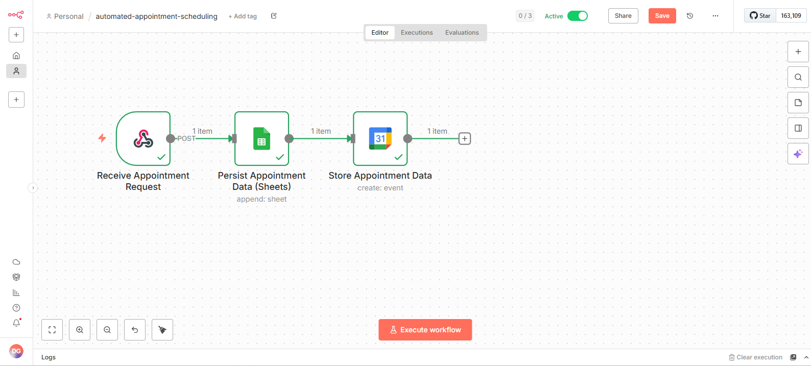
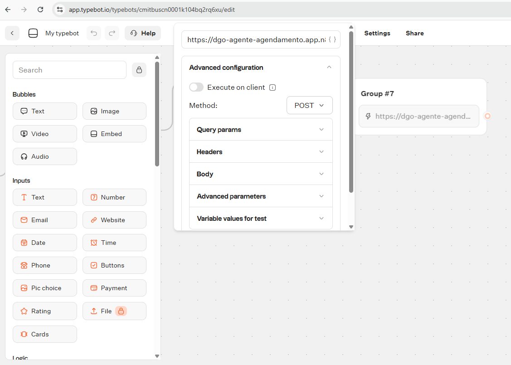
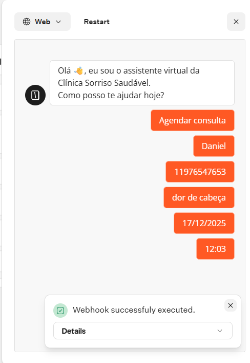
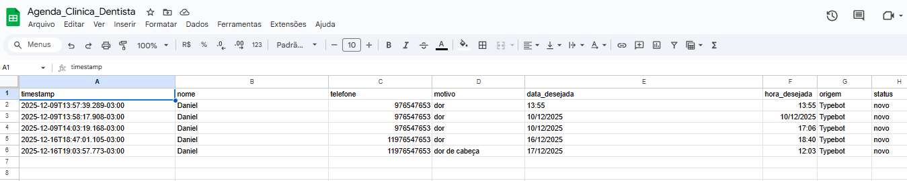
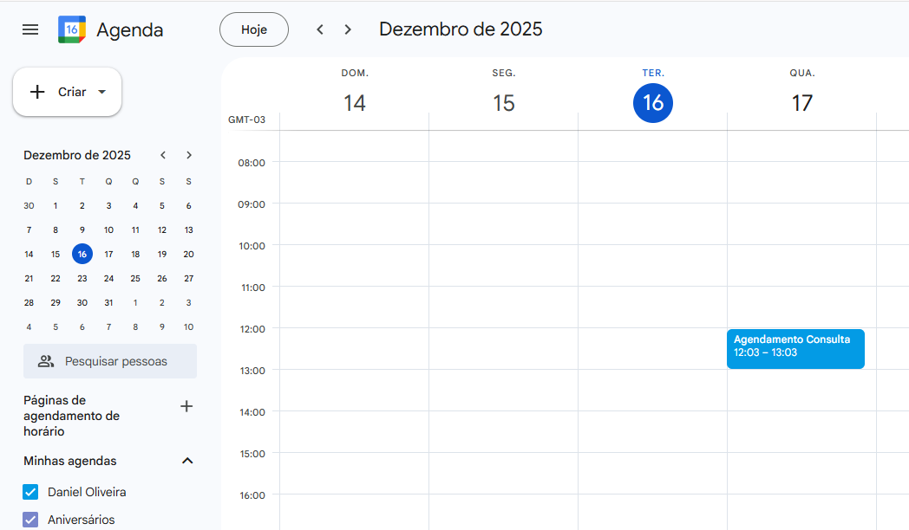

# POC – Automated Appointment Scheduling

Proof of Concept (POC) for an automated appointment scheduling system integrating a chatbot, workflow automation, and Google services.

This project demonstrates how service appointments can be scheduled end-to-end without human intervention, using low-code / no-code tools.

---

## 📌 Overview

The solution automates the full appointment flow:

1. User interacts with a chatbot (Typebot)
2. Required data is collected (name, phone, reason, date, time)
3. Data is sent via webhook to n8n
4. n8n persists the data in Google Sheets
5. An appointment is automatically created in Google Calendar

---

## 🎯 Objectives

- Demonstrate automation of appointment scheduling
- Showcase integration between chatbot, workflow automation, and Google APIs
- Provide a reusable architecture for service-based businesses
- Serve as a technical portfolio project

---

## 🧱 Architecture

**Flow overview:**

Typebot → Webhook → n8n → Google Sheets → Google Calendar

---

## 🛠️ Tech Stack

- **Typebot** – Chatbot and user interaction
- **n8n** – Workflow automation
- **Google Sheets** – Data persistence
- **Google Calendar** – Appointment scheduling
- **Webhooks** – System integration

---

## 🔄 n8n Workflow

The n8n workflow is composed of the following steps:

1. **Receive Appointment Request**  
   Receives data from Typebot via webhook

2. **Persist Appointment Data (Sheets)**  
   Stores appointment details in Google Sheets

3. **Store Appointment Data (Calendar)**  
   Creates an event in Google Calendar

📷 Workflow diagram:



---

## 🤖 Typebot Flow

The chatbot guides the user through the scheduling process:

- Greeting and options menu
- Name collection
- Phone number collection
- Reason for appointment
- Preferred date
- Preferred time
- Webhook submission

📷 Typebot flow screens:





---

## 📊 Google Sheets – Data Storage

All appointment requests are stored in Google Sheets for tracking and auditing purposes.

📷 Example sheet:



---

## 📅 Google Calendar – Scheduled Appointments

Once processed, appointments are automatically created in Google Calendar.

📷 Calendar view:



---

## 📁 Repository Structure

```text
poc-agendamento-automatizado/
│
├── docs/
│   └── fluxo-geral.md
│
├── images/
│   ├── automated-appointment-scheduling_n8n.png
│   ├── Google_Calendar.png
│   ├── Google_Sheet.png
│   ├── Typebot_Fluxo_1.png
│   ├── Typebot_Fluxo_2.png
│   ├── Typebot_Fluxo_3.png
│   ├── Typebot_Fluxo_4.png
│   └── Typebot_Fluxo_5.png
│
├── n8n/
│   └── automated-appointment-scheduling.json
│
├── typebot/
│   └── (Typebot flow screenshots)
│
└── README.md


##📝 Notes

This project was built as a Proof of Concept

Designed with clarity, modularity, and reusability in mind

Easily adaptable for clinics, service providers, and scheduling platforms

Ideal for technical demos, proposals, and portfolio presentation

##👤 Author

Daniel Oliveira
DGO Data Solutions
AI, Chatbots & Data Automation Solutions
